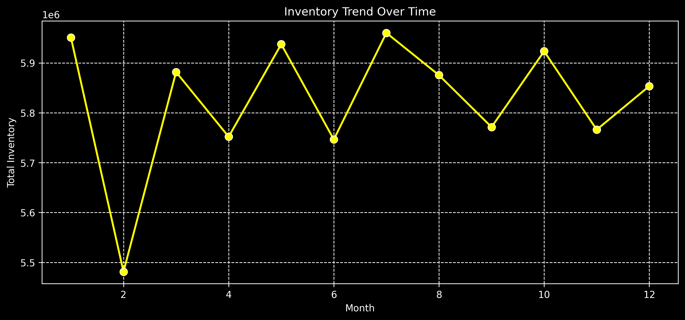
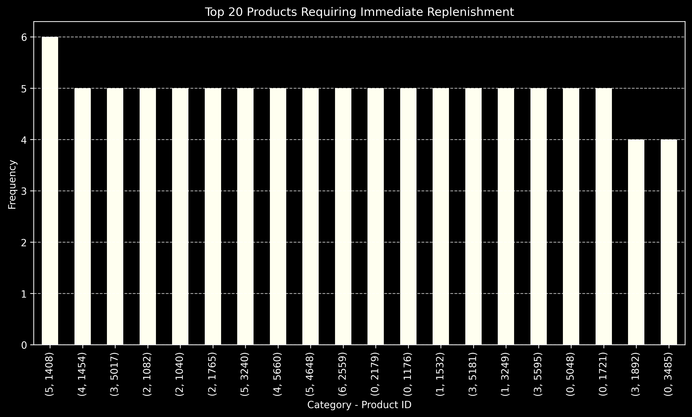
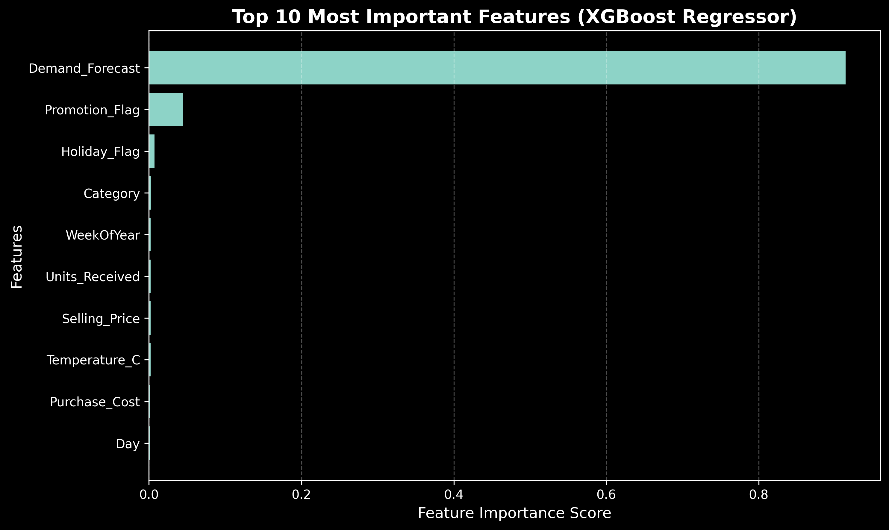
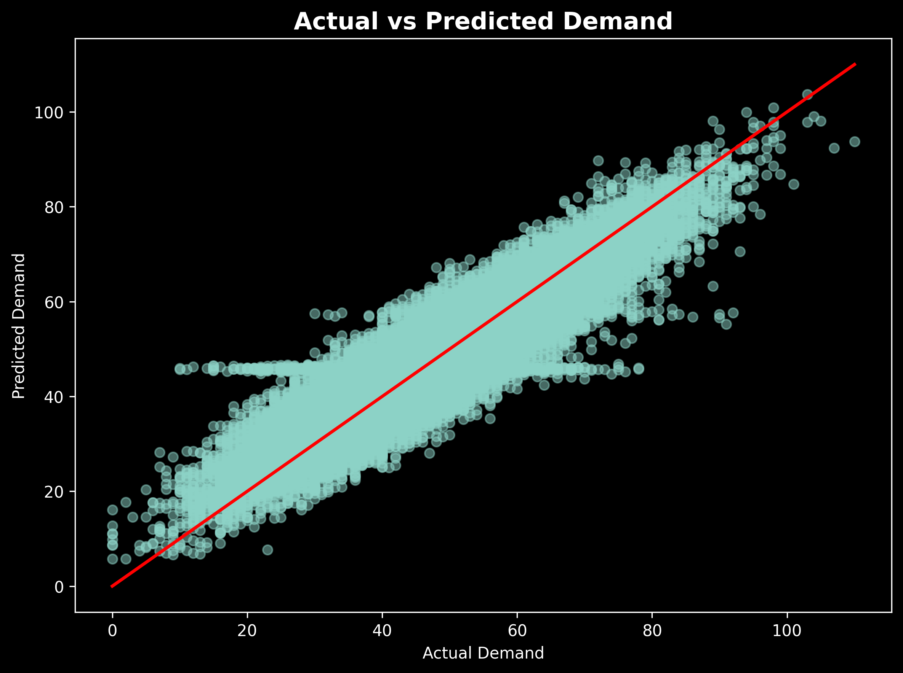
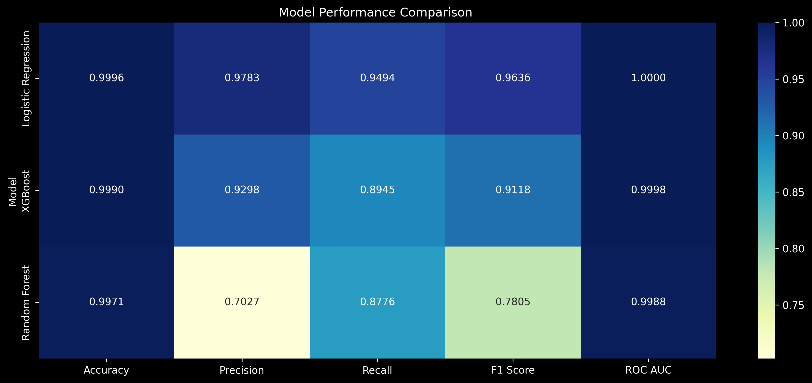

# Inventory Demand Forecasting and Stock-out Prediction using Machine Learning

## Overview

Efficient inventory management is critical for maintaining product availability while minimizing operational costs. Businesses frequently struggle with demand uncertainty, stock-outs, excess inventory, and delayed supplier deliveries, all of which directly impact profitability and customer satisfaction.

This project presents an end-to-end Machine Learning solution that forecasts inventory demand, predicts stock-out risk, and recommends optimal reorder quantities. Alongside predictive modeling, the project includes business-focused exploratory analysis to uncover inventory patterns, supplier performance, and replenishment opportunities that support better operational decision-making.

---
## Project Dashboard


## Business Problem

Inventory planning is one of the most challenging tasks in supply chain management. Ordering too much inventory increases holding costs, while ordering too little results in stock-outs and lost revenue.

The objective of this project is to leverage historical inventory data and Machine Learning techniques to answer critical business questions such as:

- Which products frequently require replenishment?
- Which warehouses experience recurring stock shortages?
- Which suppliers contribute to delivery delays?
- What factors drive product demand?
- Which products are at the highest risk of stock-out?
- How much inventory should be reordered?

The solution aims to transform raw inventory data into actionable business insights.

---

## Project Objectives

- Forecast future inventory demand using Machine Learning.
- Predict stock-out risk before inventory shortages occur.
- Identify products requiring immediate replenishment.
- Analyze supplier performance and delivery delays.
- Generate business insights through exploratory data analysis.
- Recommend optimized reorder quantities for inventory planning.

---

## Dataset

The project uses an inventory management dataset containing operational information related to products, warehouses, suppliers, demand forecasts, inventory levels, reorder thresholds, lead times, and stock availability.

Key attributes include:

- Product Information
- Warehouse Details
- Supplier Details
- Inventory Levels
- Demand Forecast
- Lead Time
- Reorder Level
- Stock Status

---

## Technology Stack

- Python
- Pandas
- Matplotlib
- Seaborn
- Scikit-learn
- XGBoost
- Jupyter Notebook

---

## Project Workflow

1. Data Cleaning and Preparation
2. Exploratory Data Analysis
3. Business Insight Generation
4. Feature Engineering
5. Machine Learning Model Development
6. Model Evaluation
7. Stock-out Prediction
8. Reorder Quantity Recommendation

---

## Exploratory Data Analysis

The project investigates several business-oriented inventory questions, including:

- Inventory trend analysis
- Warehouse stock availability
- Immediate replenishment requirements
- Supplier delivery performance
- Product demand distribution
- Inventory health monitoring
- Stock-out risk identification

These analyses help explain business behaviour before predictive models are applied.

---

## Machine Learning Models

### Demand Forecasting (Regression)

- Linear Regression
- Random Forest Regressor
- XGBoost Regressor

### Stock-out Prediction (Classification)

- Logistic Regression
- Random Forest Classifier
- XGBoost Classifier

Model performance was evaluated using appropriate regression and classification metrics to identify the best-performing model.

---

## Model Performance

### Best Regression Model

**XGBoost Regressor**

| Metric | Value |
|---------|------:|
| MAE | 4.47 |
| RMSE | 5.74 |
| R² Score | 0.827 |

The model demonstrates strong predictive capability for inventory demand forecasting while maintaining low prediction error.

---

## Key Visualizations

### Inventory Trend Analysis



---

### Products Requiring Immediate Replenishment



---

### Supplier Delivery Delay Analysis


---

### Feature Importance (XGBoost)



---

### Actual vs Predicted Demand



---

### Model Performance Comparison



---

### Products at High Stock-out Risk


---

### Recommended Reorder Quantity


---

## Business Impact

This solution demonstrates how predictive analytics can improve inventory planning by:

- Forecasting future product demand.
- Identifying inventory shortages before they occur.
- Prioritizing products requiring immediate replenishment.
- Supporting supplier performance monitoring.
- Optimizing reorder decisions.
- Enabling data-driven inventory management.

The approach can help organizations reduce stock-outs, improve product availability, and make more informed operational decisions.

---

## My Contribution

This project was developed as a **team project**.

My primary contributions included:

- Data preprocessing and cleaning
- Exploratory Data Analysis (EDA)
- Business problem analysis
- Feature engineering
- Machine Learning model development
- Model evaluation
- Data visualization
- Business insight generation
- Inventory planning recommendations

---

## Repository Structure

```
inventory-demand-forecasting-and-stockout-prediction
│
├── data
├── images
├── notebooks
│   └── inventory_demand_forecasting.ipynb
├── requirements.txt
├── .gitignore
└── README.md
```

---

## Future Enhancements

Potential improvements for future versions include:

- Time-series demand forecasting
- Real-time inventory monitoring dashboard
- Automated stock-out alert system
- Cloud deployment
- Integration with ERP or warehouse management systems

---

## Acknowledgement

This project was completed as part of a collaborative team initiative focused on applying Machine Learning techniques to solve real-world inventory management challenges.
